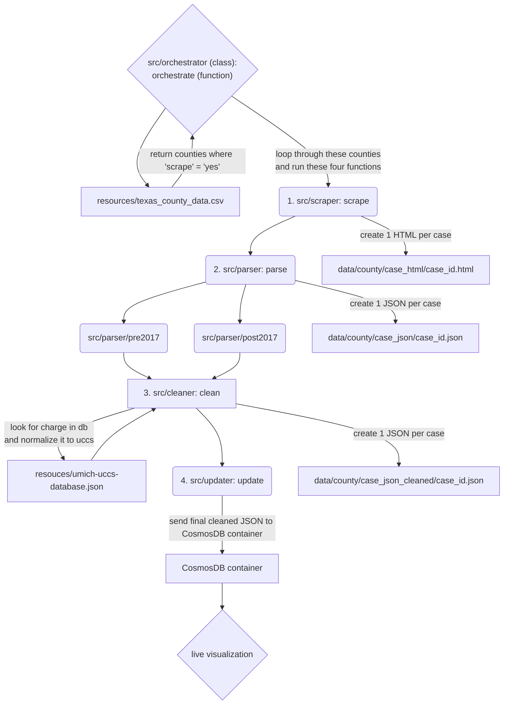

# Tyler Technologies Odyssey scraper and parser

This is a scraper to collect and process public case records from the Tyler Technologies Odyssey court records system. If you are a dev or want to file an Issue, please read [CONTRIBUTING](CONTRIBUTING.md).

## Install

1. Clone this repo and navigate to it.
   - `git clone https://github.com/open-austin/indigent-defense-stats`
   - `cd indigent-defense-stats`
2. Install Pyenv if not already installed ([linux, mac](https://github.com/pyenv/pyenv), or [windows](https://github.com/pyenv-win/pyenv-win))
3. Run `pyenv install` to get the right Python version
4. Run `python -m venv .venv --prompt ids` (you can substitute `ids` for any name you want)
5. Run `source .venv/bin/activate` \*
6. With pip, install the requirements.
   - `pip install -r requirements.txt`
7. Set any parameters.
   - counties = The counties that are listed in the count CSV. Update column "scraper" in the CSV to "yes" to include the county.
   - start_date = The first date you want to scrape for case data. Update in scraper.
   - end_date = The last date you want to scrape for case data. Update in scraper.
8. Run the handler.
   - python3 run python .src/orchestrator

`*` - This command will need to be ran every time you start the project.

## Structure of Code

- County Database: A CSV table contains the necessary Odyssey links and version for each county in Texas. One column ("scrape") indicates whether that county should be scraped. Currently, Hays is the default.
- Handler (src/handler): This reads the CSV for the counties to be scraped and runs the following processes for each county. You can also set the start and end date of the parser here.

  - **Scraper** (`src/scraper`): This scrapes all of the judicial officers for each day within the period set in the handler and saves all of the HTML to data/[county name]/case_html.
  - **Parser** (`src/parser`): This parses all of the HTML in the county-specific HTML folder to accompanying JSON files in data/[county name]/case_json.
  - **Cleaner** (`src/cleaner`): This cleans and redacts information in in the county-specific json folder to a new folder of JSON files in data/[county name]/case_json_cleaned.
  - **Updater** (`src/updater`): This pushed the cleaned and redacted JSON in the county-specific cleaned json folder to a container in CosmosDB where it can then be use for visualization.

## Flowchart: Relationships Between Functions and Directories

