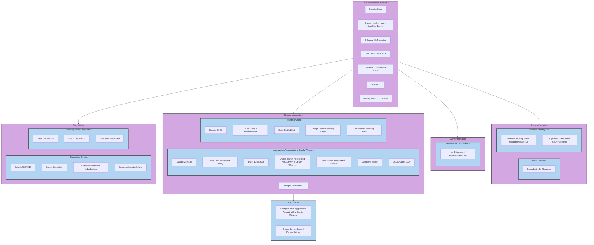

## Data Structure of the Cleaned Cases JSON

```mermaid
graph TB
    subgraph CaseInformation[Case Information Summary]
        style CaseInformation fill:#d3a8e2,stroke:#333,stroke-width:2px
        A1[County: Hays]
        A2[Cause Number Hash: dsqn91cn1odmo]
        A3[Odyssey ID: Redacted]
        A4[Date Filed: 01/01/2015]
        A5[Location: 22nd District Court]
        A6[Version: 1]
        A7[Parsing Date: 2024-01-01]
    end

    subgraph PartyInformation[Party Information]
        style PartyInformation fill:#d3a8e2,stroke:#333,stroke-width:2px

        subgraph DefendantInfoBox[Defendant Info]
        style DefendantInfoBox fill:#b0d4f1,stroke:#333,stroke-width:2px
        D8[Defendant Info: Redacted]
        end
        subgraph RepresentationInfo[Defense Attorney Info]
            style RepresentationInfo fill:#b0d4f1,stroke:#333,stroke-width:2px
            B1[Defense Attorney Hash: 9083bb693e33919c]
            B2[Appointed or Retained: Court Appointed]

        end

    end

    subgraph Events[Event Information]
        style Events fill:#d3a8e2,stroke:#333,stroke-width:2px
        subgraph EvidenceofRep[Representation Evidence]
            style EvidenceofRep fill:#b0d4f1,stroke:#333,stroke-width:2px
            B3[Has Evidence of Representation: No]
        end

    end

    subgraph ChargeInformation[Charge Information]
        style ChargeInformation fill:#d3a8e2,stroke:#333,stroke-width:2px

        subgraph Charge1[Aggravated Assault with a Deadly Weapon]
            style Charge1 fill:#b0d4f1,stroke:#333,stroke-width:2px
            C1[Statute: 22.02a2]
            C2[Level: Second Degree Felony]
            C3[Date: 10/25/2015]
            C4[Charge Name: Aggravated Assault with a Deadly Weapon]
            C5[Description: Aggravated Assault]
            C6[Category: Violent]
            C7[UCCS Code: 1200]
        end

        subgraph Charge2[Resisting Arrest]
            style Charge2 fill:#b0d4f1,stroke:#333,stroke-width:2px
            C8[Statute: 38.03]
            C9[Level: Class A Misdemeanor]
            C10[Date: 10/25/2015]
            C11[Charge Name: Resisting Arrest]
            C12[Description: Resisting Arrest]
        end

        E3[Charges Dismissed: 1]


    end

    subgraph TopCharge[Top Charge]
        style TopCharge fill:#b0d4f1,stroke:#333,stroke-width:2px
        E1[Charge Name: Aggravated Assault with a Deadly Weapon]
        E2[Charge Level: Second Degree Felony]
    end

    subgraph Dispositions[Dispositions]
        style Dispositions fill:#d3a8e2,stroke:#333,stroke-width:2px

        subgraph Disposition1[Disposition Details]
            style Disposition1 fill:#b0d4f1,stroke:#333,stroke-width:2px
            D1[Date: 12/06/2016]
            D2[Event: Disposition]
            D3[Outcome: Deferred Adjudication]
            D4[Sentence Length: 1 Year]
        end

        subgraph Disposition2[Resisting Arrest Disposition]
            style Disposition2 fill:#b0d4f1,stroke:#333,stroke-width:2px
            D5[Date: 12/06/2016]
            D6[Event: Disposition]
            D7[Outcome: Dismissed]
        end
    end


    CaseInformation --> PartyInformation
    CaseInformation --> ChargeInformation
    CaseInformation --> Dispositions
    CaseInformation --> Events
    ChargeInformation --> TopCharge
```
