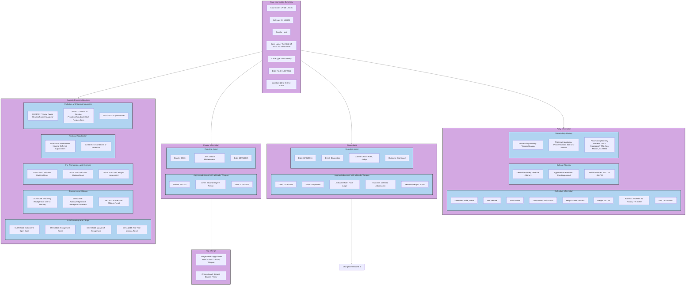

```mermaid
graph TB
    subgraph CaseInformation[Case Information Summary]
        style CaseInformation fill:#d3a8e2,stroke:#333,stroke-width:2px
        A1[Case Code: CR-15-1234-C]
        A2[Odyssey ID: 198372]
        A3[County: Hays]
        A4[Case Name: The State of Texas vs. Fake Name]
        A5[Case Type: Adult Felony]
        A6[Date Filed: 01/01/2015]
        A7[Location: 22nd District Court]
    end

    subgraph PartyInformation[Party Information]
        style PartyInformation fill:#d3a8e2,stroke:#333,stroke-width:2px

        subgraph DefendantInfo[Defendant Information]
            style DefendantInfo fill:#b0d4f1,stroke:#333,stroke-width:2px
            B1[Defendant: Fake, Name]
            B2[Sex: Female]
            B3[Race: White]
            B4[Date of Birth: 01/01/1980]
            B5[Height: 5 foot 6 inches]
            B6[Weight: 200 lbs]
            B7[Address: 876 Main St, Natalia, TX 78059]
            B8[SID: TX01234567]
        end

        subgraph DefenseAttorney[Defense Attorney]
            style DefenseAttorney fill:#b0d4f1,stroke:#333,stroke-width:2px
            B9[Defense Attorney: Defense Attorney]
            B10[Appointed or Retained: Court Appointed]
            B11[Phone Number: 512-123-4567 W]
        end

        subgraph ProsecutingAttorney[Prosecuting Attorney]
            style ProsecutingAttorney fill:#b0d4f1,stroke:#333,stroke-width:2px
            B12[Prosecuting Attorney: Yuuuuu Haaaaa]
            B13[Prosecuting Attorney Phone Number: 512-321-8596 W]
            B14[Prosecuting Attorney Address: 712 S Stagecoach TRL, San Marcos, TX 78666]
        end
    end

    subgraph ChargeInformation[Charge Information]
        style ChargeInformation fill:#d3a8e2,stroke:#333,stroke-width:2px

        subgraph Charge1[Aggravated Assault with a Deadly Weapon]
            style Charge1 fill:#b0d4f1,stroke:#333,stroke-width:2px
            C1[Statute: 22.02a2]
            C2[Level: Second Degree Felony]
            C3[Date: 10/25/2015]
        end

        subgraph Charge2[Resisting Arrest]
            style Charge2 fill:#b0d4f1,stroke:#333,stroke-width:2px
            C4[Statute: 38.03]
            C5[Level: Class A Misdemeanor]
            C6[Date: 10/25/2015]
        end
    end

    subgraph Dispositions[Dispositions]
        style Dispositions fill:#d3a8e2,stroke:#333,stroke-width:2px

        subgraph Disposition1[Aggravated Assault with a Deadly Weapon]
            style Disposition1 fill:#b0d4f1,stroke:#333,stroke-width:2px
            D1[Date: 12/06/2016]
            D2[Event: Disposition]
            D3[Judicial Officer: Fake, Judge]
            D4[Outcome: Deferred Adjudication]
            D5[Sentence Length: 1 Year]
        end

        subgraph Disposition2[Resisting Arrest]
            style Disposition2 fill:#b0d4f1,stroke:#333,stroke-width:2px
            D6[Date: 12/06/2016]
            D7[Event: Disposition]
            D8[Judicial Officer: Fake, Judge]
            D9[Outcome: Dismissed]
        end

    end

    subgraph TopCharge[Top Charge]
        style TopCharge fill:#d3a8e2,stroke:#333,stroke-width:2px

        E1[Charge Name: Aggravated Assault with a Deadly Weapon]
        E2[Charge Level: Second Degree Felony]
    end

    subgraph EventsHearings[Example Events & Hearings]
        style EventsHearings fill:#d3a8e2,stroke:#333,stroke-width:2px

        subgraph InitialHearings[Initial Hearings and Filings]
            style InitialHearings fill:#b0d4f1,stroke:#333,stroke-width:2px
            F1[01/05/2016: Indictment Open Case]
            F2[02/24/2016: Arraignment Reset]
            F3[03/15/2016: Waiver of Arraignment]
            F4[04/14/2016: Pre-Trial Motions Reset]
        end

        subgraph DiscoveryMotions[Discovery and Motions]
            style DiscoveryMotions fill:#b0d4f1,stroke:#333,stroke-width:2px
            G1[04/29/2016: Discovery Receipt from District Attorney]
            G2[05/05/2016: Acknowledgment of Receipt of Discovery]
            G3[06/15/2016: Pre-Trial Motions Reset]
        end

        subgraph PreTrial[Pre-Trial Motions and Hearings]
            style PreTrial fill:#b0d4f1,stroke:#333,stroke-width:2px
            H1[07/27/2016: Pre-Trial Motions Reset]
            H2[08/25/2016: Pre-Trial Motions Reset]
            H3[09/26/2016: Plea Bargain Agreement]
        end

        subgraph TrialAdjudication[Trial and Adjudication]
            style TrialAdjudication fill:#b0d4f1,stroke:#333,stroke-width:2px
            I1[12/06/2016: Punishment Hearing Deferred Adjudication]
            I2[12/06/2016: Conditions of Probation]
        end

        subgraph ProbationWarrants[Probation and Warrant Issuances]
            style ProbationWarrants fill:#b0d4f1,stroke:#333,stroke-width:2px
            J1[10/24/2017: Show Cause Hearing Failure to Appear]
            J2[11/01/2017: Motion to Revoke Probation/Adjudicate Guilt Reopen Case]
            J3[02/23/2022: Capias Issued]
        end
    end

    CaseInformation --> PartyInformation
    CaseInformation --> ChargeInformation
    ChargeInformation --> TopCharge
    CaseInformation --> Dispositions
    Dispositions --> D10[Charges Dismissed: 1]
    CaseInformation --> EventsHearings
```