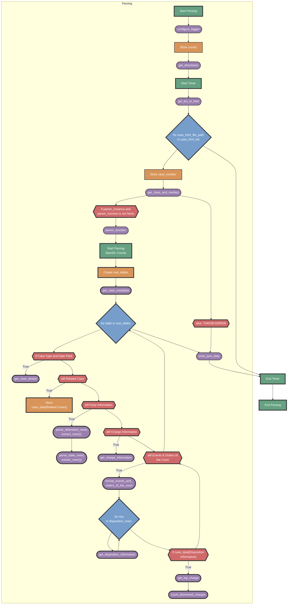

```mermaid
graph TD
    subgraph Parsing
        A[Start Parsing] --> B([configure_logger])
        B --> C[Store county]
        C --> D([get_directories])
        D --> E[Start Timer]
        E --> F([get_list_of_html])
        F --> G{for case_html_file_path<br>in case_html_list}
        G --> H[Store case_number]
        H --> I([get_class_and_method])
        I --> J{{if parser_instance and<br>parser_function is not None}}
        J --> L([parser_function])
        I --> K{{else: THROW ERROR}}
        DD --> M([write_json_data])
        K --> M([write_json_data])
        L --> AA[Start Parsing<br>Specific County]
        AA --> BB[Create root_tables]
        BB --> CC([get_case_metadata])
        CC --> DD{for table in root_tables}
        DD --> EE{{if Case Type and Date Filed}}
        EE -- True --> JJ([get_case_details])
        EE --> FF{{elif Related Case}}
        FF -- True --> KK[Store<br>case_data#91;Related Cases#93;]
        FF --> GG{{elif Party Information}}
        GG -- True --> LL([parse_defendant_rows#40;<br>extract_rows#40;#41;#41;])
        LL --> MM([parse_state_rows#40;<br>extract_rows#40;#41;#41;])
        GG --> HH{{elif Charge Information}}
        HH -- True --> NN([get_charge_information])
        HH --> II{{elif Events & Orders of<br>the Court}}
        II --> DD
        II -- True --> OO([format_events_and_<br>orders_of_the_court])
        OO --> PP{for row<br>in disposition_rows:}
        PP --> QQ([get_disposition_information])
        QQ --> PP
        PP --> RR{{if case_data#91;Disposition<br>Information#93;}}
        RR -- True --> SS([get_top_charge])
        RR --> II
        SS --> TT([count_dismissed_charges])


    end
        M --> Y
        G --> Y[End Timer]
        Y --> Z[End Parsing]

        style A fill:#66A182,stroke:#333,stroke-width:4px,color:#FFF
        style B fill:#9A7FAE,stroke:#333,stroke-width:2px,color:#FFF
        style C fill:#D99559,stroke:#333,stroke-width:2px,color:#FFF
        style D fill:#9A7FAE,stroke:#333,stroke-width:2px,color:#FFF
        style E fill:#66A182,stroke:#333,stroke-width:4px,color:#FFF
        style F fill:#9A7FAE,stroke:#333,stroke-width:2px,color:#FFF
        style G fill:#779ECB,stroke:#333,stroke-width:4px,color:#FFF
        style H fill:#D99559,stroke:#333,stroke-width:2px,color:#FFF
        style I fill:#9A7FAE,stroke:#333,stroke-width:2px,color:#FFF
        style J fill:#D06A6A,stroke:#333,stroke-width:4px,color:#FFF    
        style K fill:#D06A6A,stroke:#333,stroke-width:4px,color:#FFF    
        style L fill:#9A7FAE,stroke:#333,stroke-width:2px,color:#FFF
        style M fill:#9A7FAE,stroke:#333,stroke-width:2px,color:#FFF
        style Y fill:#66A182,stroke:#333,stroke-width:4px,color:#FFF
        style Z fill:#66A182,stroke:#333,stroke-width:4px,color:#FFF

        style AA fill:#66A182,stroke:#333,stroke-width:4px,color:#FFF
        style BB fill:#D99559,stroke:#333,stroke-width:4px,color:#FFF
        style CC fill:#9A7FAE,stroke:#333,stroke-width:4px,color:#FFF
        style DD fill:#779ECB,stroke:#333,stroke-width:4px,color:#FFF
        style EE fill:#D06A6A,stroke:#333,stroke-width:4px,color:#FFF
        style FF fill:#D06A6A,stroke:#333,stroke-width:4px,color:#FFF
        style GG fill:#D06A6A,stroke:#333,stroke-width:4px,color:#FFF
        style HH fill:#D06A6A,stroke:#333,stroke-width:4px,color:#FFF
        style II fill:#D06A6A,stroke:#333,stroke-width:4px,color:#FFF    
        style JJ fill:#9A7FAE,stroke:#333,stroke-width:4px,color:#FFF
        style KK fill:#D99559,stroke:#333,stroke-width:4px,color:#FFF
        style LL fill:#9A7FAE,stroke:#333,stroke-width:4px,color:#FFF
        style MM fill:#9A7FAE,stroke:#333,stroke-width:4px,color:#FFF
        style NN fill:#9A7FAE,stroke:#333,stroke-width:4px,color:#FFF
        style OO fill:#9A7FAE,stroke:#333,stroke-width:4px,color:#FFF
        style PP fill:#779ECB,stroke:#333,stroke-width:4px,color:#FFF
        style QQ fill:#9A7FAE,stroke:#333,stroke-width:4px,color:#FFF
        style RR fill:#D06A6A,stroke:#333,stroke-width:4px,color:#FFF
        style SS fill:#9A7FAE,stroke:#333,stroke-width:4px,color:#FFF
        style TT fill:#9A7FAE,stroke:#333,stroke-width:4px,color:#FFF

```

