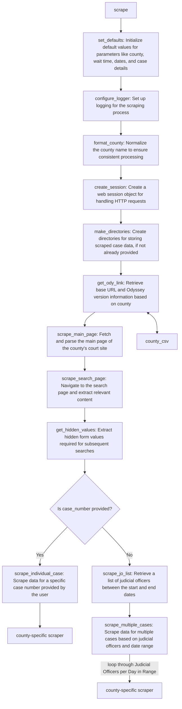

```mermaid
graph TD

  A[scrape] --> B[set_defaults: Initialize default values for parameters like county, wait time, dates, and case details]
  B --> C[configure_logger: Set up logging for the scraping process]
  C --> D[format_county: Normalize the county name to ensure consistent processing]
  D --> E[create_session: Create a web session object for handling HTTP requests]
  E --> F[make_directories: Create directories for storing scraped case data, if not already provided]
  F --> G[get_ody_link: Retrieve base URL and Odyssey version information based on county]
  G --> H[scrape_main_page: Fetch and parse the main page of the county's court site]
  G <--> O[county_csv]
  H --> I[scrape_search_page: Navigate to the search page and extract relevant content]
  I --> J[get_hidden_values: Extract hidden form values required for subsequent searches]

  J --> K{Is case_number provided?}
  K -- Yes --> L[scrape_individual_case: Scrape data for a specific case number provided by the user]
  L --> Q[county-specific scraper]
  K -- No --> M[scrape_jo_list: Retrieve a list of judicial officers between the start and end dates]
  M --> N[scrape_multiple_cases: Scrape data for multiple cases based on judicial officers and date range]
  N -- loop through Judicial Officers per Day in Range --> R[county-specific scraper]
```
